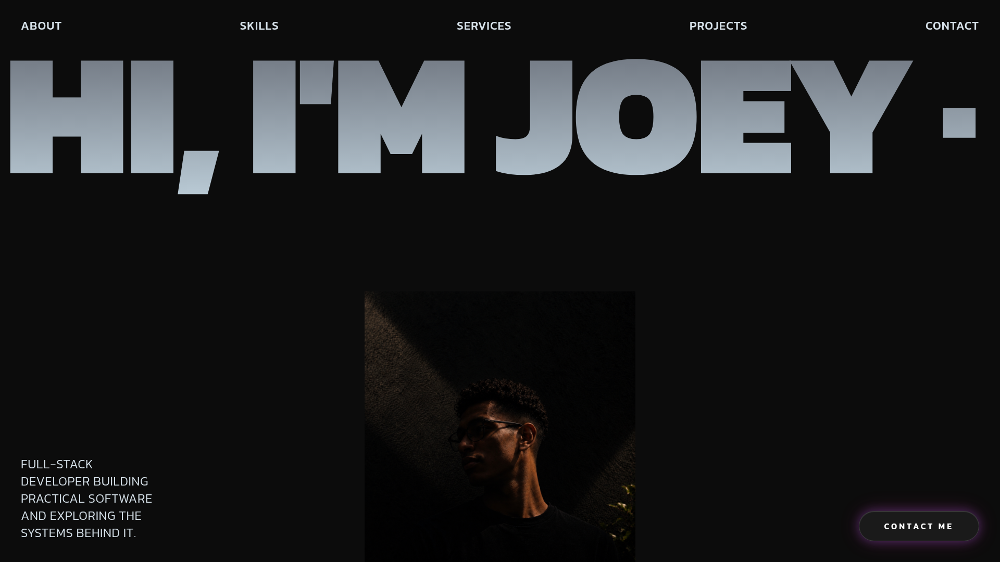

# Joey — Portfolio

A personal portfolio site for Joey, a full-stack developer. Single-page, animated landing page built with React, TypeScript, and Tailwind CSS, server-rendered via TanStack Start.

> Live site: _https://joey-a.pages.dev/_

## Preview



## Overview

The site is one scrolling page made up of self-contained sections:

| Section          | File                  | What it shows                                         |
| ---------------- | --------------------- | ----------------------------------------------------- |
| Header / Nav     | `HeroSection.tsx`     | Sticky nav links + animated hero heading and portrait |
| Marquee          | `MarqueeSection.tsx`  | Scrolling logo/image strip                            |
| About            | `AboutSection.tsx`    | Bio copy with a scroll-reveal text animation          |
| Skills           | `SkillsSection.tsx`   | Auto-scrolling row of tech/skill pills                |
| Services         | `ServicesSection.tsx` | Numbered list of services offered                     |
| Projects         | `ProjectsSection.tsx` | Scroll-driven stacked project cards                   |
| Footer / Contact | `FooterSection.tsx`   | Call to action, email, and social links               |

## Tech stack

- **Framework:** React 19 + TypeScript, server-rendered with [TanStack Start](https://tanstack.com/start) (file-based routing via TanStack Router)
- **Build tool:** Vite 7
- **Styling:** Tailwind CSS v4
- **Animation:** Framer Motion (scroll-linked reveals, sticky card stacking)
- **UI kit:** [shadcn/ui](https://ui.shadcn.com) components on top of Radix UI primitives (`src/components/ui`)
- **Icons:** lucide-react, react-icons
- **Linting/formatting:** ESLint (flat config) + Prettier
- **Deployment target:** Cloudflare Pages, built via the Nitro `cloudflare_pages` preset (a `vercel.json` is also included for deploying to Vercel instead)

## Project structure

```
src/
├── assets/              Project & portrait images
├── components/
│   ├── jack/             Page sections (Hero, About, Skills, Services,
│   │                       Projects, Footer, Marquee) and shared bits
│   │                       (AnimatedText, FadeIn, ContactButton, Magnet)
│   └── ui/                shadcn/ui component library
├── hooks/                 use-mobile (viewport breakpoint hook)
├── lib/                   utils, server config, error reporting
├── routes/                TanStack Start routes (index.tsx = `/`, __root.tsx = app shell)
├── router.tsx / start.ts / server.ts   TanStack Start wiring
└── styles.css             Global styles & Tailwind entry point
```

Routing follows TanStack Start's file-based convention — see `src/routes/README.md` for the rules (e.g. `index.tsx` → `/`, `__root.tsx` is the shared app shell). `src/routeTree.gen.ts` is auto-generated; don't edit it by hand.

## Getting started

**Prerequisites:** Node.js 20+ and npm.

```bash
# install dependencies
npm install

# start the dev server
npm run dev
```

The dev server prints a local URL (defaults to Vite's dev port) — open it in your browser.

## Available scripts

| Command             | Description                              |
| ------------------- | ---------------------------------------- |
| `npm run dev`       | Start the Vite dev server                |
| `npm run build`     | Production build (outputs to `.output/`) |
| `npm run build:dev` | Build in development mode                |
| `npm run preview`   | Preview a production build locally       |
| `npm run lint`      | Run ESLint                               |
| `npm run format`    | Format the codebase with Prettier        |

## Deployment

The build is configured for **Cloudflare Pages** by default (`vite.config.ts` sets the Nitro preset to `cloudflare_pages`), producing a `dist/`-shaped output with a Pages Function. A `vercel.json` (`{ "framework": "tanstack-start" }`) is also included if you'd rather deploy to Vercel.

```bash
npm run build
```

Then deploy the build output using your platform's CLI or Git integration.

## Contact

- Email: [joeyanley.tech@gmail.com](mailto:joeyanley.tech@gmail.com)
- GitHub: [github.com/joeyanil](https://github.com/joeyanil)
- Instagram: [@its.junox](https://instagram.com/its.junox)
- Telegram: [@Juno_xo](https://t.me/Juno_xo)

---

© 2026 Joey · A. All rights reserved.
